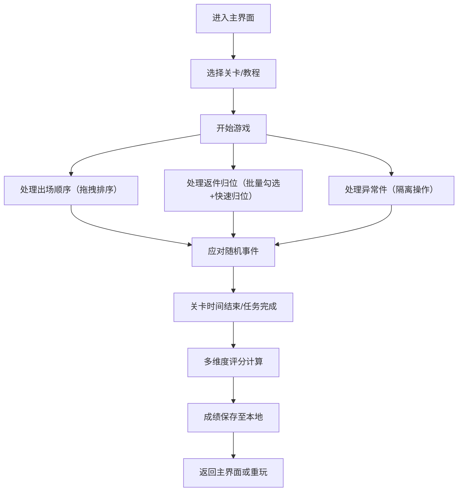

## 1. 产品概述
土铃整理小游戏是一款以民艺展演现场为背景的单机整理类游戏，玩家负责土铃的出场排序、返件归位和异常隔离工作。

- 核心玩法：通过拖拽、批量勾选、快速归位等操作处理土铃管理任务
- 目标用户：喜欢整理类、益智类小游戏的玩家
- 产品价值：在紧张有序的任务处理中锻炼玩家的逻辑思维和反应能力

## 2. 核心 Features

### 2.1 游戏模式
| 模式 | 说明 | 核心机制 |
|------|------|----------|
| 关卡模式 | 递进式难度挑战 | 4个关卡，逐步引入复杂机制 |
| 教程模式 | 新手引导 | 分步讲解游戏规则和操作方法 |

### 2.2 功能模块
1. **主界面**：开始游戏、教程、关卡选择、成绩记录
2. **游戏界面**：待处理土铃列表、出场顺位队列、状态提示区、操作按钮
3. **结算界面**：多维度评分展示、成绩保存

### 2.3 页面详情
| 页面名称 | 模块名称 | 功能描述 |
|-----------|-------------|---------------------|
| 主界面 | 导航区 | 显示游戏标题、开始按钮、教程入口、成绩榜入口 |
| 主界面 | 关卡选择 | 展示4个关卡，显示通关状态和最高分 |
| 游戏界面 | 待处理列表 | 展示需要处理的土铃，支持拖拽、勾选 |
| 游戏界面 | 顺位队列 | 展示当前出场顺序，支持拖拽排序 |
| 游戏界面 | 返件区 | 展示需要归位的土铃，支持批量操作 |
| 游戏界面 | 异常区 | 隔离异常件，支持快速处理 |
| 游戏界面 | 状态提示 | 显示当前关卡事件、倒计时、暂停按钮 |
| 结算界面 | 评分面板 | 顺位正确率、返件完整率、异常隔离及时性、整体耗时 |
| 结算界面 | 成绩保存 | 本地存储历史最高分 |
| 教程界面 | 分步引导 | 讲解各项操作和评分规则 |

## 3. 核心流程

### 3.1 游戏主流程

### 3.2 关卡事件系统
- **顺位打乱**：已排好的顺序被部分打乱，需要快速调整
- **返件漏记**：部分返件未被记录，需要额外识别
- **临时停用**：某件土铃临时不能出场，需要从队列中移除
- **串场延迟**：主持人串场，操作时间暂停但计时继续

## 4. 用户界面设计

### 4.1 设计风格
- **设计方向**：典雅东方民俗风格，呼应民艺展演主题
- **主色调**：土陶褐 (#8B4513)、朱砂红 (#8B0000)、米黄底 (#F5F5DC)
- **辅助色**：墨绿 (#2F4F4F)、古铜金 (#B8860B)
- **字体**：标题用 "Noto Serif SC" 衬线体，正文用 "Noto Sans SC" 无衬线体
- **按钮风格**：圆角矩形，轻微立体效果，hover 时有细微浮动动画
- **图标风格**：使用 lucide-react 线性图标，统一线条粗细
- **背景质感**：米黄色底配合细微宣纸纹理

### 4.2 页面设计概述
| 页面名称 | 模块名称 | UI 元素 |
|-----------|-------------|-------------|
| 主界面 | 标题区 | 大号衬线字体标题，副标题，装饰性分隔线 |
| 主界面 | 关卡卡片 | 4张卡片，显示关卡名称、难度星级、最高分、通关状态 |
| 游戏界面 | 三栏布局 | 左：待处理列表，中：顺位队列，右：返件/异常区 |
| 游戏界面 | 顶部状态栏 | 关卡名、倒计时、当前得分、暂停按钮 |
| 游戏界面 | 事件提示条 | 顶部滑入式提示，显示当前事件类型 |
| 结算界面 | 评分仪表盘 | 4个评分维度，每项用进度条和百分比展示 |
| 结算界面 | 总分展示 | 大号字体显示综合得分，星级评价 |
| 教程界面 | 卡片式引导 | 图文分步说明，可前进后退 |

### 4.3 响应式设计
- 桌面端：三栏并列布局，充分利用屏幕宽度
- 平板端：两栏布局，底部折叠面板
- 移动端：单列布局，标签页切换

### 4.4 交互与动画
- 拖拽操作：拖拽时元素半透明，目标位置高亮显示
- 列表项：hover 时轻微上浮，选中时有边框高亮
- 事件触发：顶部提示条滑入，配合音效感震动动画
- 页面切换：淡入淡出过渡，300ms 时长
- 归位操作：元素从当前位置平滑移动到目标区

## 5. 评分系统

### 5.1 评分维度
| 维度 | 权重 | 计算方式 |
|------|------|----------|
| 顺位正确率 | 30% | 正确排序的土铃数量 / 总数量 × 100% |
| 返件完整率 | 25% | 正确归位的土铃数量 / 应归位数量 × 100% |
| 异常隔离及时性 | 25% | 异常件在出现后 3 秒内隔离得满分，每延迟 1 秒扣 10% |
| 整体耗时 | 20% | 剩余时间 / 总时间 × 100% |

### 5.2 等级评价
- S 级：95 分以上
- A 级：85-94 分
- B 级：70-84 分
- C 级：60-69 分
- D 级：60 分以下
