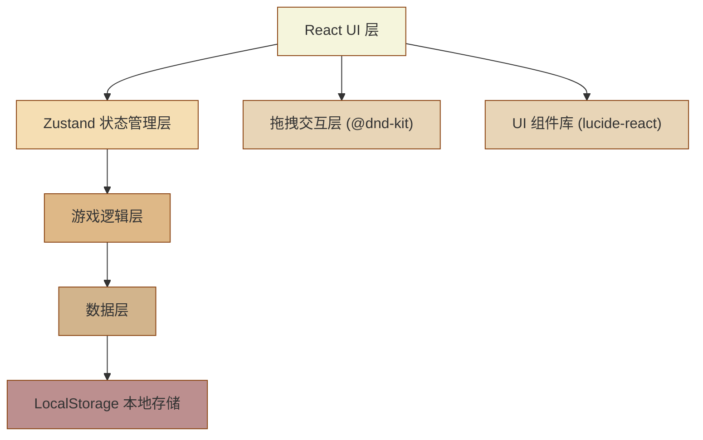
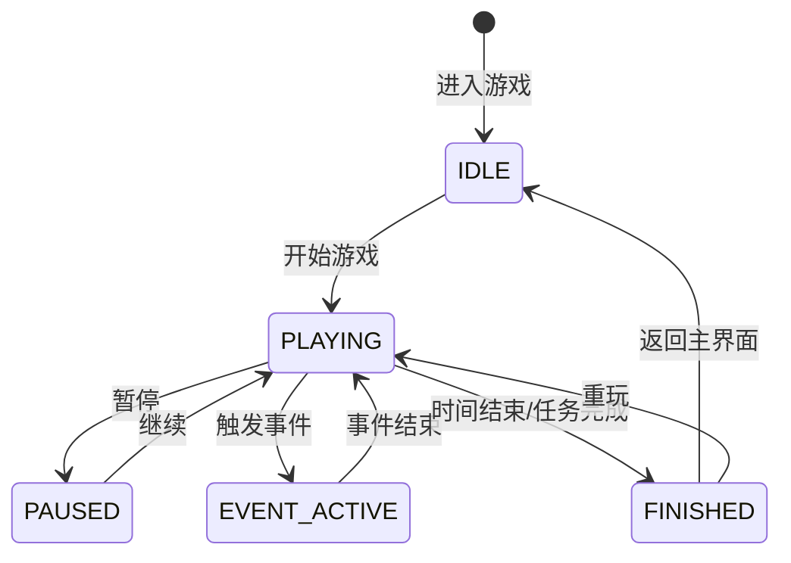

## 1. 架构设计



## 2. 技术描述

- **前端框架**：React 18 + TypeScript
- **构建工具**：Vite 5
- **样式方案**：Tailwind CSS 3
- **状态管理**：Zustand
- **路由管理**：React Router DOM 6
- **拖拽库**：@dnd-kit/core + @dnd-kit/sortable
- **图标库**：lucide-react
- **本地存储**：localStorage API
- **包管理器**：npm

## 3. 目录结构

```
src/
├── components/          # 可复用组件
│   ├── game/           # 游戏相关组件
│   │   ├── BellItem.tsx
│   │   ├── BellList.tsx
│   │   ├── SortableQueue.tsx
│   │   ├── ReturnZone.tsx
│   │   ├── IsolationZone.tsx
│   │   ├── StatusBar.tsx
│   │   ├── EventToast.tsx
│   │   └── PauseOverlay.tsx
│   ├── layout/         # 布局组件
│   │   └── PageLayout.tsx
│   └── ui/             # 基础 UI 组件
│       ├── Button.tsx
│       ├── Card.tsx
│       ├── ProgressBar.tsx
│       └── Checkbox.tsx
├── pages/              # 页面组件
│   ├── HomePage.tsx
│   ├── GamePage.tsx
│   ├── ResultPage.tsx
│   └── TutorialPage.tsx
├── store/              # Zustand 状态管理
│   └── useGameStore.ts
├── data/               # 关卡数据
│   ├── levels.ts
│   └── bells.ts
├── hooks/              # 自定义 Hooks
│   ├── useTimer.ts
│   ├── useScoring.ts
│   └── useGameEvents.ts
├── utils/              # 工具函数
│   ├── storage.ts
│   ├── scoring.ts
│   └── types.ts
├── router/             # 路由配置
│   └── index.tsx
├── App.tsx
├── main.tsx
└── index.css
```

## 4. 路由定义

| 路由 | 页面 | 功能 |
|-------|------|------|
| `/` | HomePage | 主界面，显示关卡选择、教程入口、成绩榜 |
| `/game/:levelId` | GamePage | 游戏主界面，处理土铃整理任务 |
| `/result` | ResultPage | 结算界面，显示评分和保存成绩 |
| `/tutorial` | TutorialPage | 教程界面，分步讲解游戏规则 |

## 5. 数据模型

### 5.1 核心类型定义

```typescript
// 土铃类型
interface Bell {
  id: string;
  name: string;
  code: string;        // 编号，用于排序
  category: string;    // 分类
  status: 'pending' | 'queued' | 'returned' | 'isolated';
  isAbnormal: boolean; // 是否异常件
  abnormalReason?: string;
  disabled: boolean;   // 是否临时停用
  correctPosition: number; // 正确顺位
}

// 关卡配置
interface Level {
  id: number;
  name: string;
  description: string;
  difficulty: 1 | 2 | 3 | 4;
  totalTime: number;   // 总时间（秒）
  bells: Bell[];       // 土铃列表
  events: GameEvent[]; // 事件配置
  targetReturnCount: number; // 应归位数量
}

// 游戏事件
interface GameEvent {
  id: string;
  type: 'shuffle' | 'missing' | 'disable' | 'delay';
  triggerTime: number; // 触发时间（秒）
  duration?: number;   // 持续时间
  targetBellIds?: string[];
  message: string;
}

// 评分结果
interface ScoreResult {
  orderAccuracy: number;      // 顺位正确率 0-100
  returnCompleteness: number; // 返件完整率 0-100
  isolationTimeliness: number; // 异常隔离及时性 0-100
  timeEfficiency: number;     // 整体耗时 0-100
  totalScore: number;         // 总分 0-100
  grade: 'S' | 'A' | 'B' | 'C' | 'D';
  timeUsed: number;           // 用时（秒）
}

// 游戏状态
interface GameState {
  currentLevel: Level | null;
  bells: Bell[];
  queue: string[];       // 顺位队列（土铃ID数组）
  selectedBells: string[]; // 批量勾选的土铃ID
  timeRemaining: number;
  isPaused: boolean;
  isRunning: boolean;
  activeEvent: GameEvent | null;
  isolationRecords: { bellId: string; time: number }[];
  abnormalAppearTimes: Record<string, number>;
}

// 成绩记录
interface ScoreRecord {
  levelId: number;
  levelName: string;
  score: ScoreResult;
  date: string;
}
```

### 5.2 本地存储数据结构

```typescript
// localStorage 存储键
const STORAGE_KEYS = {
  SCORES: 'tuling_game_scores',    // 历史成绩
  PROGRESS: 'tuling_game_progress' // 关卡进度
};

// 进度数据
interface GameProgress {
  unlockedLevels: number[];    // 已解锁关卡
  highScores: Record<number, number>; // 各关卡最高分
  completedLevels: number[];   // 已通关关卡
}
```

## 6. 核心模块设计

### 6.1 状态管理 (useGameStore)

```typescript
// 主要 actions
const useGameStore = create<GameState & GameActions>((set, get) => ({
  // ... state
  startGame: (levelId: number) => {},
  pauseGame: () => {},
  resumeGame: () => {},
  endGame: () => {},
  addToQueue: (bellId: string, position?: number) => {},
  removeFromQueue: (bellId: string) => {},
  reorderQueue: (fromIndex: number, toIndex: number) => {},
  toggleSelect: (bellId: string) => {},
  selectAll: () => {},
  clearSelection: () => {},
  batchReturn: () => {},
  quickReturn: (bellId: string) => {},
  isolateBell: (bellId: string) => {},
  triggerEvent: (event: GameEvent) => {},
  clearEvent: () => {},
  tick: () => {},
}));
```

### 6.2 评分计算逻辑

```typescript
// utils/scoring.ts
function calculateOrderAccuracy(bells: Bell[], queue: string[]): number {
  // 计算顺位正确率：检查队列中的土铃顺序是否与 correctPosition 一致
}

function calculateReturnCompleteness(
  bells: Bell[],
  targetCount: number
): number {
  // 计算返件完整率：已归位数量 / 目标数量
}

function calculateIsolationTimeliness(
  records: { bellId: string; time: number }[],
  appearTimes: Record<string, number>
): number {
  // 计算异常隔离及时性：3秒内满分，每延迟1秒扣10%
}

function calculateTimeEfficiency(
  timeUsed: number,
  totalTime: number
): number {
  // 计算时间效率：剩余时间 / 总时间
}

function calculateTotalScore(components: {
  orderAccuracy: number;
  returnCompleteness: number;
  isolationTimeliness: number;
  timeEfficiency: number;
}): number {
  // 加权计算总分
  return (
    components.orderAccuracy * 0.3 +
    components.returnCompleteness * 0.25 +
    components.isolationTimeliness * 0.25 +
    components.timeEfficiency * 0.2
  );
}

function getGrade(score: number): 'S' | 'A' | 'B' | 'C' | 'D' {
  // 根据总分返回等级
}
```

### 6.3 关卡数据 (data/levels.ts)

4个关卡配置，难度递进：

- **关卡1 - 初出茅庐**：6个土铃，仅排序和归位，无异常事件
- **关卡2 - 渐入佳境**：8个土铃，引入异常隔离和顺位打乱事件
- **关卡3 - 游刃有余**：10个土铃，增加返件漏记和临时停用事件
- **关卡4 - 炉火纯青**：12个土铃，所有事件随机触发，时间更紧张

## 7. 状态机设计



## 8. 性能优化

- 使用 React.memo 优化列表项渲染
- 拖拽操作使用 CSS transform 而非 DOM 重排
- 定时器使用 requestAnimationFrame 优化
- 本地存储读写做防抖处理
- 状态更新使用不可变数据模式
